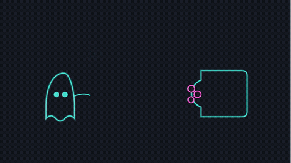

<h1 align="center">inkling</h1>

<p align="center">
  <b>Code-driven, hand-drawn animated explainer videos — with a themeable mascot.</b><br>
  No AI image model. No AI video model. Just SVG + CSS → frames → ffmpeg. Deterministic & free.
</p>

---

## 🤖 Set it up by pasting this into any AI agent

Copy-paste the block below into Claude Code, Cursor, Codex, or any coding agent. It will clone, install, learn the system, and render the demo for you:

```text
Set up the "inkling" toolkit for me, end to end:

1. git clone https://github.com/ahkamboh/inkling && cd inkling
2. Read README.md, SKILL.md and STYLES.md fully — this is a system for generating
   hand-drawn animated explainer videos purely from SVG + CSS (no AI image/video model).
3. Run: npm install      (installs Puppeteer + Chromium)
4. Render the example:  bash build.sh   →  produces examples/demo.mp4
5. Learn the model: each "scene" is one idea, authored as an animated SVG in
   scenes/sceneN.html (CSS keyframes + a recurring mascot). The renderer freezes the
   CSS clock frame-by-frame and ffmpeg stitches + crossfades the scenes.
6. The look is a design system: re-skin with a THEME (data-theme="ink|flat|blueprint|
   chalk|riso|neon|grid|marker|pastel") and a SHAPE (<use href="#c-bean|round|square|
   tall|triangle|pill|cloud|ghost">). Full reference in STYLES.md.

When done: confirm the demo rendered, then propose 3 scene ideas (with the 7-beat
structure: establish → arrive → notice → wind-up → act → recover → loop) for my topic:
<<PUT YOUR TOPIC HERE>>
```

---

## 🎬 Demo

Two micro-explainers, generated entirely from code (`scenes/scene1–2.html`):



> 1. **Caffeine blocks your sleepy signal** *(neon · ghost)* — caffeine jams the receptor, so the adenosine "sleepy" molecule keeps bouncing off.
> 2. **Tiny habits compound** *(notebook · square)* — one small block a day stacks into a tower as the compound curve climbs.
>
> Full-quality MP4: [`examples/demo.mp4`](examples/demo.mp4) · preview every shape × theme in [`styles/gallery.html`](styles/gallery.html)

---

## Why

Most "AI explainer" tools give you generic, drifting, un-editable images. `inkling` is the opposite:

- **Deterministic** — same input always renders the same frames. Safe for a real video pipeline.
- **Consistent IP** — one recurring mascot (white-dot eyes, thin legs, deadpan) across an entire series.
- **Directable motion** — a reusable 7-beat acting structure (anticipation, squash, follow-through, easing) — not a Ken Burns pan over a still.
- **Free & offline** — no API keys, no per-render cost, no model that warps your line art or garbles labels.
- **Diff-able** — scenes are text. Version them, review them, template them.

## Quickstart

```bash
git clone https://github.com/ahkamboh/inkling && cd inkling
npm install          # Puppeteer + Chromium
bash build.sh        # renders all scenes → examples/demo.mp4
bash build.sh 3      # render just scene 3 while iterating
```

Requirements: **Node 18+**, **ffmpeg** on PATH.

## How it works

```
scenes/sceneN.html   one idea = one animated SVG (CSS keyframes + the mascot)
        │
   render.js         Puppeteer loads each scene, freezes document.getAnimations()
        │            frame-by-frame, screenshots a deterministic frame sequence
        ▼
   build.sh          ffmpeg: frames → per-scene mp4 → white-padded 1080p → xfade → demo.mp4
```

Add a scene = add a `scenes/sceneN.html` and re-run `bash build.sh`. The 7-beat skeleton
(establish → arrive → notice → wind-up → act → recover → loop) is the template; copy an
existing scene and swap the props, paths and labels.

## The look — shapes × themes

A "look" is one **shape** + one **theme**. Switch with a single attribute; everything re-skins.

| | keys |
|---|---|
| **themes** (`data-theme="…"`) | `ink` · `flat` · `blueprint` · `chalk` · `riso` · `neon` · `grid` · `marker` · `pastel` |
| **shapes** (`<use href="#c-…">`) | `c-bean` · `c-round` · `c-square` · `c-tall` · `c-triangle` · `c-pill` · `c-cloud` · `c-ghost` |

```html
<link rel="stylesheet" href="styles/themes.css">
<div data-theme="neon">
  <svg viewBox="0 0 100 130"><use href="#c-ghost"/></svg>   <!-- ghost + neon -->
</div>
```

Open [`styles/gallery.html`](styles/gallery.html) to preview every shape and theme. Full
token reference and how to theme a whole video: [STYLES.md](STYLES.md).

## Repo layout

```
inkling/
├─ scenes/        scene1–2.html   — the demo scenes, one idea per file
├─ styles/        themes.css · characters.svg · gallery.html   — the design system
├─ render.js      Puppeteer deterministic frame-grabber
├─ build.sh       frames → mp4 → crossfade → demo.mp4
├─ examples/      demo.mp4 · demo.gif
├─ STYLES.md      shape + theme shortcut reference
└─ SKILL.md       how an AI agent authors new scenes
```

## License

MIT © 2026 [Ali Hamza Kamboh (@ahkamboh)](https://github.com/ahkamboh)

<sub>Built with Claude Code. Style inspired by hand-drawn "body-text" explainer illustration.</sub>
