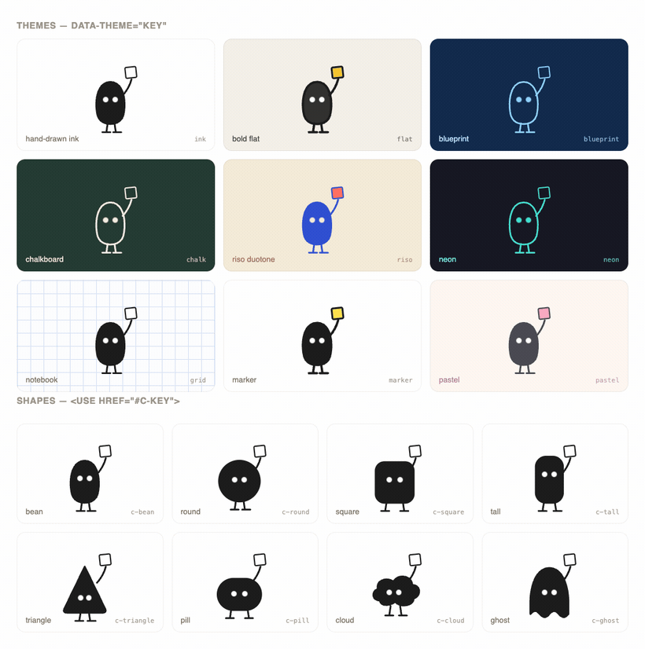

<h1 align="center">inkling</h1>

<p align="center">
  <b>Code-driven, hand-drawn animated explainer videos — with a themeable mascot.</b><br>
  No AI image model. No AI video model. Just SVG + CSS → frames → ffmpeg. Deterministic & free.
</p>

<p align="center">
  
  
  
  
</p>

---

## 🎬 YouTube → hand-drawn explainer (new)

Turn any YouTube video into an audio-reactive hand-drawn motion graphic — **your AI agent does the thinking, no API key.** inkling stays the same as everything else here: paste a prompt into Claude Code / Cursor / Codex and it works.

**Paste this into your agent:**

```text
Use inkling to turn this YouTube video into a hand-drawn explainer:
<<PASTE YOUTUBE URL>>

1. Run:  node yt.js <<URL>>          (downloads audio, transcribes, extracts amplitude)
2. Read youtube/<slug>/brief.md — it has the transcript, title, channel and your hints.
   It also prints the exact slug + commands for steps 4-6.
3. Clear the shipped demo scenes:  rm -f scenes/scene*.html
4. Author the scenes yourself (scenes/scene1.html, scene2.html, … numbered from 1) per
   SKILL.md — one idea per scene, mascot performs the idea, pick a theme that fits.
   Drive the audio-reactive pulse from var(--beat, 0) in any transform. (Clean cuts keep
   the pulse in sync with the audio — no transition meta needed here.)
5. Render with audio reacting:
      OUT_NAME=yt-<slug>.silent AMP_FILE=youtube/<slug>/amp.json bash build.sh
6. Mix the original audio in:    bash mix.sh <slug>
   → examples/yt-<slug>.mp4
```

**Why no API key?** The agent you're already in *is* the brain — it reads the transcript and authors the scenes, the same way it authors any other inkling scene. `yt.js` only does the mechanical, deterministic parts.

**`yt.js` does (and only does):**
1. `yt-dlp` downloads the audio track
2. local **Whisper** transcribes it → `transcript.txt`
3. `amp.py` extracts per-frame RMS amplitude → `amp.json`
4. writes a `brief.md` telling the agent exactly what to do next

Then the agent authors the scenes, renders with `AMP_FILE=…` (which injects the live audio amplitude as a `--beat` CSS variable on `:root` every frame), and `mix.sh` muxes the original audio back in.

**Options** (hints written into the brief for the agent to honour):

| Flag | Default | What it does |
|------|---------|--------------|
| `--max <secs>` | 300 | Only use the first N seconds of the video |
| `--theme <name>` | agent picks | Suggest a theme (ink/chalk/neon/…) |
| `--shape <name>` | agent picks | Suggest a mascot shape |
| `--beats <n>` | auto | Suggest number of scenes |

**Requires:** `yt-dlp` (`pip install -U yt-dlp` or `brew install yt-dlp`), `ffmpeg`, `python3` (`pip install -U openai-whisper`). **No API key. No paid model.**

```bash
npm install                                   # first time only (Puppeteer)
node yt.js https://youtu.be/VIDEO_ID          # prep — then let your agent author + render
```

The `--beat` CSS variable (0→1, the live audio amplitude) is injected into every scene's `:root` each frame, so any scene can react to the audio — just write `calc(1 + var(--beat, 0) * 0.4)` in a transform.

---

## 🤖 Set it up by pasting this into any AI agent

Copy-paste the block below into Claude Code, Cursor, Codex, or any coding agent. It will clone, install, learn the system, and render the demo for you:

```text
Set up the "inkling" toolkit for me, end to end:

1. git clone https://github.com/ahkamboh/inkling && cd inkling
2. Read README.md, SKILL.md and STYLES.md fully — this is a system for generating
   hand-drawn animated explainer videos purely from SVG + CSS (no AI image/video model).
3. Run: npm install      (installs Puppeteer + Chromium)
4. Render the example:  bash build.sh   →  produces examples/demo.mp4
5. Learn the model: each "scene" is one idea, authored as an animated SVG in
   scenes/sceneN.html (CSS keyframes + a recurring mascot). The renderer freezes the
   CSS clock frame-by-frame and ffmpeg stitches + crossfades the scenes.
6. The look is a design system: re-skin with a THEME (data-theme="ink|flat|blueprint|
   chalk|riso|neon|grid|marker|pastel") and a SHAPE (<use href="#c-bean|round|square|
   tall|triangle|pill|cloud|ghost">). Full reference in STYLES.md.

When done: confirm the demo rendered, then propose 3 scene ideas (with the 7-beat
structure: establish → arrive → notice → wind-up → act → recover → loop) for my topic:
<<PUT YOUR TOPIC HERE>>
```

---

## 🎬 Demo

**A real explainer — "can you trust an AI agent?"** Ten beats authored from one paragraph (`story/scene01–10.html`), in `ink` + `bean`, each scene declaring its own transition:


> *"AI agents are changing how we work… the hard part isn't the AI — it's trusting it with real tasks. Trust gets built one small proven result at a time."*
>
> Render the same story in any theme: `bash build-reel.sh chalk story`

### One reel, three themes

The **same 10-scene showreel**, rendered in three different themes just by changing `data-theme` — with premium cinematic transitions (slide · circle-open · wipe · radial) between every scene. This *is* the pitch: **author once, ship any look.**

**`ink`**


**`neon`**


**`chalk`**


```bash
bash build-reel.sh neon      # render the reel in any theme you name
```

> **Transitions are native & declarative** — each scene picks its own out-transition with one tag:
> `<meta name="inkling:transition" content="reveal">` (friendly names: `push` · `glide` · `rise` · `wipe` · `reveal` · `burst` · `dissolve` · `diagonal` · `fade`). The agent chooses by *what happens at the cut* — see the rubric in [SKILL.md](SKILL.md).

> Also in the box — two concept micro-explainers (`scenes/scene1–2.html`): **caffeine blocks your sleepy signal** and **tiny habits compound** → [`examples/demo.mp4`](examples/demo.mp4). Preview every shape × theme in [`styles/gallery.html`](styles/gallery.html).

---

## Why

Most "AI explainer" tools give you generic, drifting, un-editable images. `inkling` is the opposite:

- **Deterministic** — same input always renders the same frames. Safe for a real video pipeline.
- **Consistent IP** — one recurring mascot (white-dot eyes, thin legs, deadpan) across an entire series.
- **Directable motion** — a reusable 7-beat acting structure (anticipation, squash, follow-through, easing) — not a Ken Burns pan over a still.
- **Free & offline** — no API keys, no per-render cost, no model that warps your line art or garbles labels.
- **Diff-able** — scenes are text. Version them, review them, template them.

## Quickstart

```bash
git clone https://github.com/ahkamboh/inkling && cd inkling
npm install          # Puppeteer + Chromium
bash build.sh        # renders all scenes → examples/demo.mp4
bash build.sh 3      # render just scene 3 while iterating
```

Requirements: **Node 18+**, **ffmpeg** on PATH.

## How it works

```
scenes/sceneN.html   one idea = one animated SVG (CSS keyframes + the mascot)
        │
   render.js         Puppeteer loads each scene, freezes document.getAnimations()
        │            frame-by-frame, screenshots a deterministic frame sequence
        ▼
   build.sh          ffmpeg: frames → per-scene mp4 → white-padded 1080p → xfade → demo.mp4
```

Add a scene = add a `scenes/sceneN.html` and re-run `bash build.sh`. The 7-beat skeleton
(establish → arrive → notice → wind-up → act → recover → loop) is the template; copy an
existing scene and swap the props, paths and labels.

## The look — every shape × every theme



A "look" is one **shape** + one **theme**. Each is called by a short **key** — name them and everything re-skins:

| | keys (call by name) |
|---|---|
| **themes** → `data-theme="…"` | `ink` · `flat` · `blueprint` · `chalk` · `riso` · `neon` · `grid` · `marker` · `pastel` |
| **shapes** → `<use href="#c-…">` | `c-bean` · `c-round` · `c-square` · `c-tall` · `c-triangle` · `c-pill` · `c-cloud` · `c-ghost` |

**In code** — drop a shape into a theme:

```html
<link rel="stylesheet" href="styles/themes.css">

<div data-theme="neon">                                <!-- theme, by name -->
  <svg viewBox="0 0 100 130"><use href="#c-ghost"/></svg>     <!-- shape, by name -->
</div>
<!--  →  a ghost mascot in the neon palette  -->
```

**When prompting an agent** — just name the keys:

```text
Make a new inkling scene about <topic> in the `chalk` theme using the `c-cloud` shape.
```
```text
Re-skin the demo — switch every scene to data-theme="riso" with the `c-tall` shape.
```

Preview them live (animated) in [`styles/gallery.html`](styles/gallery.html) · full token reference in [STYLES.md](STYLES.md).

## Repo layout

```
inkling/
├─ scenes/        scene1–2.html   — the demo scenes, one idea per file
├─ styles/        themes.css · characters.svg · gallery.html   — the design system
├─ render.js      Puppeteer deterministic frame-grabber
├─ build.sh       frames → mp4 → crossfade → demo.mp4
├─ examples/      demo.mp4 · demo.gif
├─ STYLES.md      shape + theme shortcut reference
└─ SKILL.md       how an AI agent authors new scenes
```

## License

MIT © 2026 [Ali Hamza Kamboh (@ahkamboh)](https://github.com/ahkamboh)

<sub>Built with Claude Code. Style inspired by hand-drawn "body-text" explainer illustration.</sub>
